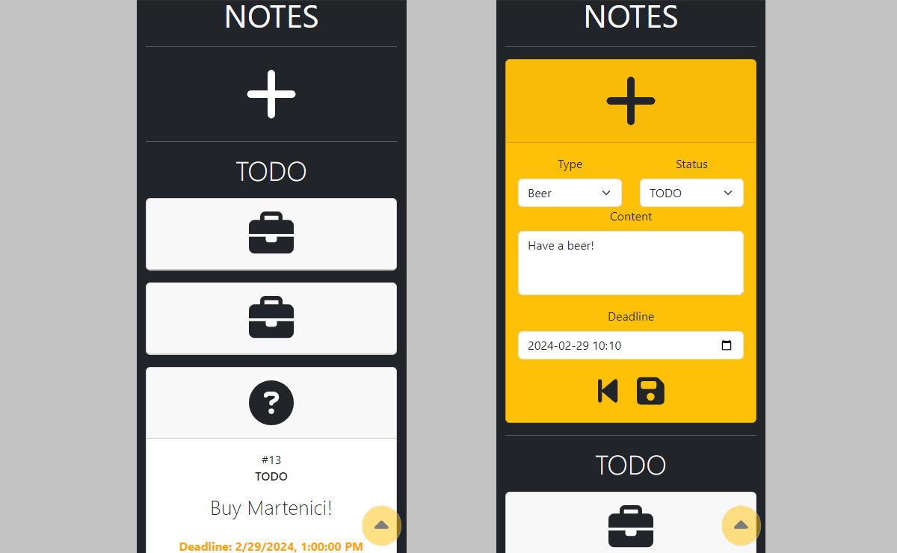
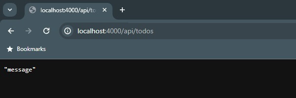

# PT_Demo_NodeJs

PT_Demo_NodeJs is a simple Node.js Web API using `express` and `sqlite` libraries.
<br>It was inspired by Les Jackson's YouTube video [3 Frameworks / 3 APIs - Step by Step Builds](https://www.youtube.com/watch?v=Zo70w5ds0-w).



## Contents
- [Prerequisites](#prerequisites)
- [Setup](#setup)
- [Implementation using SQLite, Nodemon and Body-Parser](#implementation-using-sqlite-nodemon-and-body-parser)
- [Access Header](#access-header)
    - [Hardcoded Secret](#hardcoded-secret)
    - [Secret as Env Var or in Secrets.js](#secret-as-env-var-or-in-secretsjs)
    - [Secret as Env Var or in Secrets.json](#secret-as-env-var-or-in-secretsjson)
- [Backend Refactoring](#backend-refactoring)
- [Frontend Implementation](#frontend-implementation)
    - [Change Default Port 3000](#change-default-port-3000)
- [Links](#links)

## Prerequisites

1. On Windows, make sure you have `Ubuntu` installed.

💡 In case you don't, download it from [here](https://ubuntu.com/desktop/wsl).

2. In `Ubuntu` terminal, make sure you have `NVM (Node Version Manager)` installed:
```
nvm -v
```

💡 If you don't, install it in `Ubuntu`:
```
curl https://raw.githubusercontent.com/creationix/nvm/master/install.sh | bash
source ~/.nvm/nvm.sh
nvm -v
    0.39.7
```

3. Check the `node.js` versions installed using `nvm` command in `Ubuntu`.

💡 In case you need the LTS, go to https://nodejs.org/en to check the version and install it as follows in `Ubuntu`:

```
nvm ls
    ->       system
    iojs -> N/A (default)
    node -> stable (-> N/A) (default)
    unstable -> N/A (default)

nvm install 20.11.0
    Downloading and installing node v20.11.0...
    Downloading https://nodejs.org/dist/v20.11.0/node-v20.11.0-linux-x64.tar.xz...
    ####################################################################################    ####################################################################################    ############################################################## 100.0%
    Computing checksum with sha256sum
    Checksums matched!
    Now using node v20.11.0 (npm v10.2.4)
    Creating default alias: default -> 20.11.0 (-> v20.11.0)

nvm ls
    ->     v20.11.0
             system
    default -> 20.11.0 (-> v20.11.0)
    iojs -> N/A (default)
    unstable -> N/A (default)
    node -> stable (-> v20.11.0) (default)
    stable -> 20.11 (-> v20.11.0) (default)
    lts/* -> lts/iron (-> v20.11.0)
    lts/argon -> v4.9.1 (-> N/A)
    lts/boron -> v6.17.1 (-> N/A)
    lts/carbon -> v8.17.0 (-> N/A)
    lts/dubnium -> v10.24.1 (-> N/A)
    lts/erbium -> v12.22.12 (-> N/A)
    lts/fermium -> v14.21.3 (-> N/A)
    lts/gallium -> v16.20.2 (-> N/A)
    lts/hydrogen -> v18.19.0 (-> N/A)
    lts/iron -> v20.11.0
```

💡 You can also check the `node.js` version in `Ubuntu` using:

```
node -v
    v20.11.0
```

4. In `Ubuntu`, make sure you have `NPM (Node Package Manager)` installed:

```
npm --version
    9.8.1
```

💡 In case you don't, you can use `nvm` to install `npm` in `Ubuntu`:

```
nvm install-latest-npm
```

## Setup

1. Initialize API app:

```
cd src
npm init

This utility will walk you through creating a package.json file.
It only covers the most common items, and tries to guess sensible defaults.
See `npm help init` for definitive documentation on these fields
and exactly what they do.
Use `npm install <pkg>` afterwards to install a package and
save it as a dependency in the package.json file.

Press ^C at any time to quit.
package name: (src) node-api
version: (1.0.0)
description:
entry point: (index.js)
test command:
git repository:
keywords:
author:
license: (ISC)
About to write to C:\Projects\PT_Demo_NodeJs\src\package.json:

{
  "name": "node-api",
  "version": "1.0.0",
  "description": "",
  "main": "index.js",
  "bin": {
    "node-api": "bin/database.js"
  },
  "scripts": {
    "test": "echo \"Error: no test specified\" && exit 1"
  },
  "author": "",
  "license": "ISC"
}


Is this OK? (yes) yes
```

This should have created a simple `package.json` file in your `src` directory.

2. In `package.json` directory, install `Express`:

```
npm install express
    added 67 packages, and audited 191 packages in 5s
    23 packages are looking for funding
      run `npm fund` for details
    found 0 vulnerabilities
```

💡 Express is a very useful library for making HTTP applications?

In `src`, new `node_modules` directory and `package-lock.json` file should have been created with those installations.

3. Create new `index.js` file in `src`:

```
const express = require('express');
const app = express();

app.get('/api/notes', (req, res) => {
    res.status(200).json('message');
});

app.listen(4000, () => {
    console.log('Server running on port 4000')
});
```

4. Run the server by running:

```
node index.js
```

5. Test by calling `http://localhost:4000/api/notes`



## Implementation using SQLite, Nodemon and Body-Parser

1. In `src` directory (where `package.json` is), install `SQLite`:

```
npm install sqlite3
    npm WARN deprecated @npmcli/move-file@1.1.2: This functionality has been moved to   @npmcli/fs
    added 123 packages, and audited 124 packages in 10s
    12 packages are looking for funding
      run `npm fund` for details
    found 0 vulnerabilities
```

2. Create new `database.js` file in `src` directory:

```
const sqllite = require('sqlite3').verbose();

let db = new sqllite.Database('note.db', (err) => {
    if (err) {
        console.error(err.message);
        throw err;
    }
    else {
        console.log('Connected to db...');
        db.run(`CREATE TABLE notes (
            id INTEGER PRIMARY KEY AUTOINCREMENT,
            content TEXT,
            createdAt DATETIME)`,
            (err) => {
                if (err) {
                    console.log('Table already created!');
                }
            });
    }
});

module.exports = db;
```

3. Refactor the `GET` endpoint in `ìndex.js`:

```
const express = require('express');
const db = require('./database');

const app = express();

app.get('/api/notes', (req, res) => {
    var sql = 'SELECT * FROM notes;';
    var params = [];

    db.all(sql, params, (err, rows) => {
        if (err) {
            res.status(400).json({ "error": err.message });
        } else {
            res.status(200).json(rows);
        }
    });
});

app.listen(4000, () => {
    console.log('Server running on port 4000')
});
```

4. Test by calling `http://localhost:4000/api/notes`


5. Install `nodemon` and `body-parser`:

```
npm install nodemon --global
npm install body-parser
```

6. Next, start the application by using `nodemon`:
```
nodemon index.js
    [nodemon] 3.0.3
    [nodemon] to restart at any time, enter `rs`
    [nodemon] watching path(s): *.*
    [nodemon] watching extensions: js,mjs,cjs,json
    [nodemon] starting `node index.js`
    Server running on port 4000
    Connected to db...
    Table already created!
```

💡 You can also add the command as `start` script in `package.json`:

```
{
  ...
  "scripts": {
    "test": "echo \"Error: no test specified\" && exit 1",
    "start": "nodemon index.js"
  },
  ...
}

```

7. Add `POST` endpoint in `index.js` using `body-parser`:

```
const express = require('express');
const db = require('./database');
const bodyParser = require('body-parser');

const app = express();

app.use(bodyParser.urlencoded({extended: false}));
app.use(bodyParser.json());

app.get('/api/notes', (req, res) => {
    ...
});

app.post('/api/notes', (req, res) => {
    var errors = [];
    if (!req.body.content) {
        errors.push('No content is supplied!')
    }
    if (errors.length) {
        res.status(400).json({ 'error': errors.join(', ')});
        return;
    }

    var data = {
        content: req.body.content
    }
    var sql = 'INSERT INTO notes (content, createdAt) VALUES (?,?);';
    var params = [data.content, Date.now()];

    db.run(sql, params, function(err, result) {
        if (err) {
            res.status(400).json({ 'error': err.message });
        }
        res.status(201).json({
            id: this.lastID,
            content: data.content
        })
    });
});

app.listen(4000, () => {
    console.log('Server running on port 4000')
});
```

8. Implement `GET by Id`, `DELETE`, `PUT`, `PATCH` endpoints.

Check the latest version of `index.js` to see the finalized set of CRUD operations.

9. Test by calling the endpoints using Postman (see collection in `src` directory).


## Access Header

### Hardcoded Secret

1. In `index.js`, introduce the following middleware function:

```
function validateHeader(req, res, next) {
    const myHeaderValue = req.headers['x-auth-token'];
    if (myHeaderValue !== 'ThisIsASuperSecretToken123') {
        return res.status(403).json({ "error": "Not Allowed" });
    }
    next();
}
```

⚠️ Note that `req.headers['x-auth-token']` should be lowercase in the codebase, but when you pass the header in your HTTP requests it is recommended for it to be PascalCase: `X-Auth-Token`.

2. In all non-idempotent endpoints (POST, PUT?, PATCH, DELETE?), invoke the middleware:

Before:
```
app.post('/api/notes', (req, res) => { ... });
```

After:
```
app.post('/api/notes', validateHeader, (req, res) => { ... });
```

3. Test the endpoints described above having `X-Auth-Token` header with the correct value.

### Secret as Env Var or in Secrets.js

⚠️ Having secrets in secrets.js is not a best practice. For now these can be set as environment variables within a session.

1. Create a new `secrets.js` file and ignore it in `.gitignore`:
```
##### PT ADDED #####
secrets.js
```

2. Set `ACCESS_SECRET` const in the `secrets.js` file:
```
module.exports = {
    ACCESS_SECRET: 'Secret123'
};
```

3. On Windows, you can also set the `ACCESS_SECRET` as an environment variable in `cmd.exe`:
```
set ACCESS_SECRET=Secret123
```
Then, check its value in `cmd.exe`:
```
echo %ACCESS_SECRET%
```

On Linux, you can also set the `ACCESS_SECRET` as an environment variable in `Terminal`:
```
export ACCESS_SECRET=my-header-value-123
```
Then, check its value in `Terminal`:
```
echo $ACCESS_SECRET
```

4. Either read the `ACCESS_SECRET` value in `index.js` from the same session in the opened `cmd.exe` or from `secrets.js` if not found as env var - by declaring the following const and using it in validateHeader():

```
...
const ACCESS_SECRET = process.env.ACCESS_SECRET || require('./secrets').ACCESS_SECRET;

...

function validateHeader(req, res, next) {
    const myHeaderValue = req.headers['x-auth-token'];
    if (myHeaderValue !== ACCESS_SECRET) {
        return res.status(403).json({ "error": "Not Allowed" });
    }
    next();
}
```

### Secret as Env Var or in Secrets.json

⚠️ Having secrets in secrets.json is not a best practice. For now these can be set as environment variables within a session.

1. Do everything described in the section above.

2. Create new `secrets.json` file and add it to `.gitignore`:
```
##### PT ADDED #####
secrets.js
secrets.json
```

3. Add your secret as JSON in `secrets.json`:
```
{
    "ACCESS_SECRET": "your-secret-here"
}
```

4. Refactor the ACCESS_SECRET retrieval in `index.js` to use `./secrets.json` instead of `./secrets(.js)`:
```
// const ACCESS_SECRET = process.env.ACCESS_SECRET || require('./secrets').ACCESS_SECRET;
const ACCESS_SECRET = process.env.ACCESS_SECRET || require('./secrets.json').ACCESS_SECRET;
```

5. Test

## Backend Refactoring

1. All existing logic was moved to a new `note-app-server` directory.

2. `Note` entity was expanded to contain:
- Id
- Content
- Type
    - unknown
    - beer
    - bills
    - delivery
    - family
    - health
    - hobby
    - house
    - shop
    - travel
    - work
- Status
    - TODO
    - DOING
    - ON_HOLD
    - NOT_DOING
    - DONE
- Deadline
- CreatedAt
- UpdatedAt
- IsArchived
- IsDeleted

3. DELETE endpoint was changed in order to logically delete entities by flagging them with `isDeleted` property instead of the previous physical deletion.

4. PATCH endpoint was changed in order to update `Status` only (/api/notes/status/:id).
5. PATCH endpoint was duplicated and the new one updates `isArchived` only (/api/notes/archive/:id).

## Frontend Implementation

### Change default port 3000

Read [this article](https://stackoverflow.com/questions/40714583/how-to-specify-a-port-to-run-a-create-react-app-based-project).<br>
In `package.json`, add `PORT=3456` in `scripts/start`:

```
{
  ...
  "scripts": {
    "start": "PORT=3456 react-scripts start",
    ...
  },
  ...
}

```

## Known Issues
On Windows, the following command doesn't have any effect when executed through VSC:
```
echo REACT_APP_TEST=123
```

## Links
- https://www.youtube.com/watch?v=Zo70w5ds0-w - Les Jackson's 3 Frameworks YouTube video
- https://tecadmin.net/how-to-install-nvm-on-ubuntu-20-04/
- https://stackoverflow.com/questions/40714583/how-to-specify-a-port-to-run-a-create-react-app-based-project